# Масштабирование приложений

Развертывание класстеризованного приложения с использованием Docker Swarm и Kubernetes, сравнение производительности обоих вариантов.

## Задание 2

Содержимое локального registry, содержащего образ `hello-world`

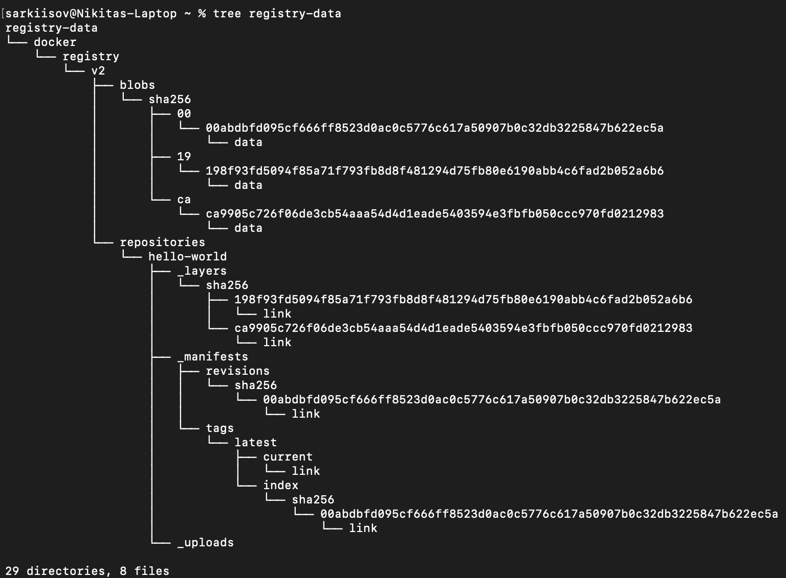

## Задание 3

Перед инициализацией registry необходимо добавить созданный сертификат в систему и выбрать опцию **Trust All**

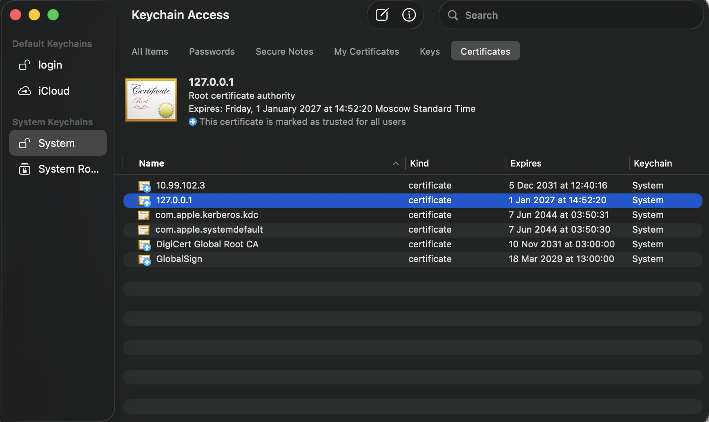

Попытка получить образ `hello-world` до и после прохождения аутентификации

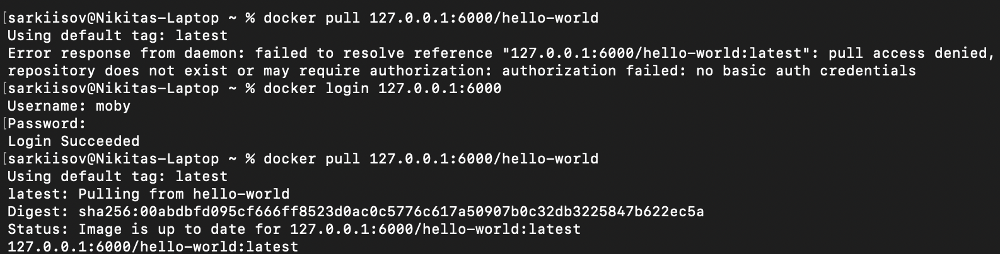

## Задание 4

Все ноды находятся в состоянии **Active**. Команда выполняется на управляющей ноде

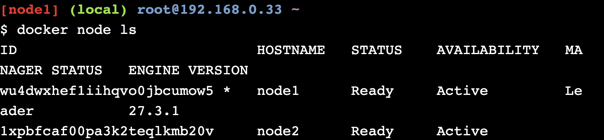

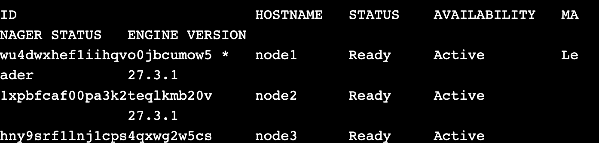

Перевод второй ноды в состояние **Drain**

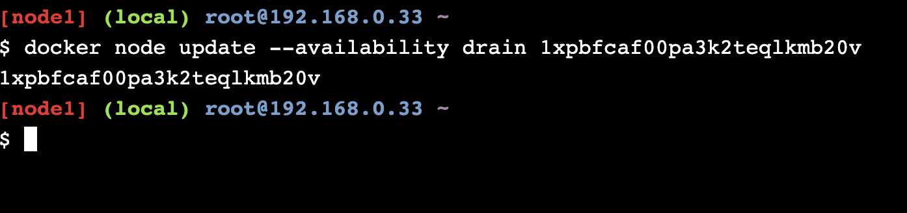

Проверка изменения состояния ноды

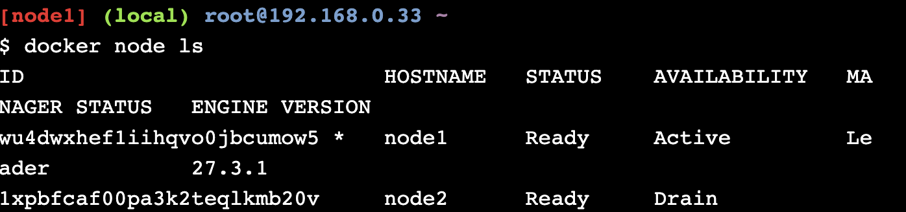

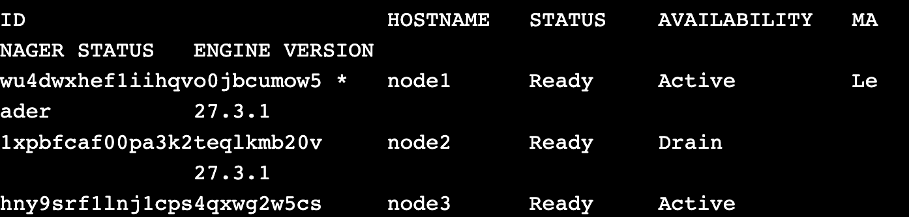

Проверка отсутствия запущенных контейнеров на ноде в состоянии **Drain**

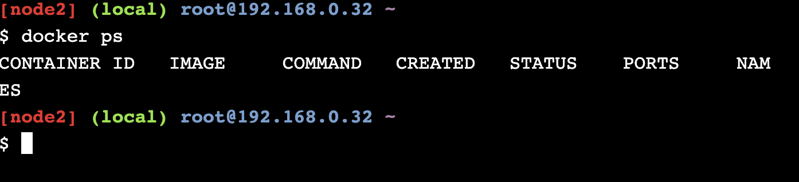

После вывода ноды из роя задачи перераспределяются между оставшимися нодами

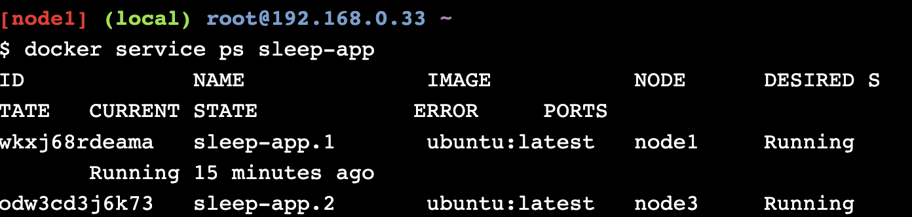

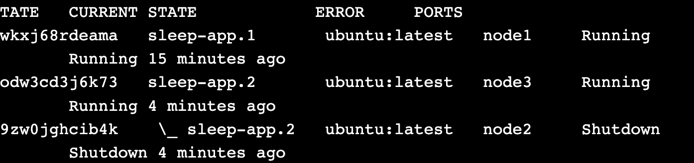

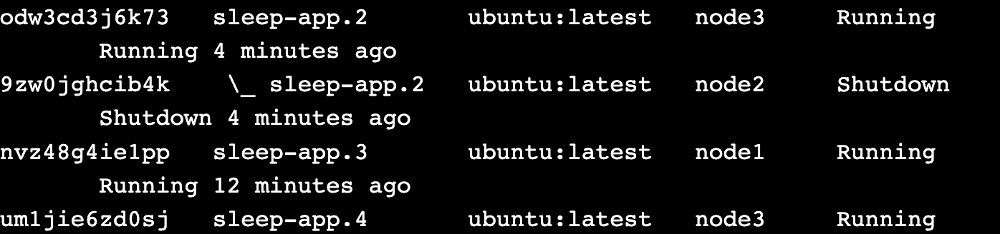

Чтобы вернуть ноду в состояние **Active**, нужно изменить availability следующей командой

```bash
docker node update --availability active <NODE_ID>
```

Все ноды вновь находятся в состоянии **Active**

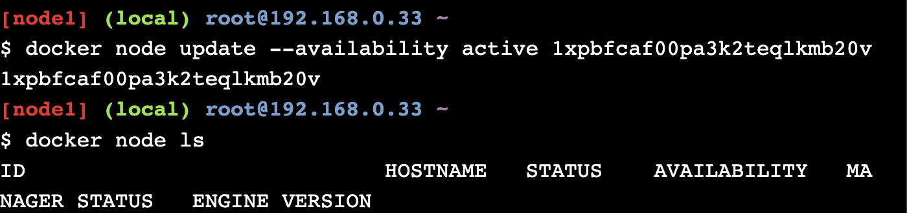

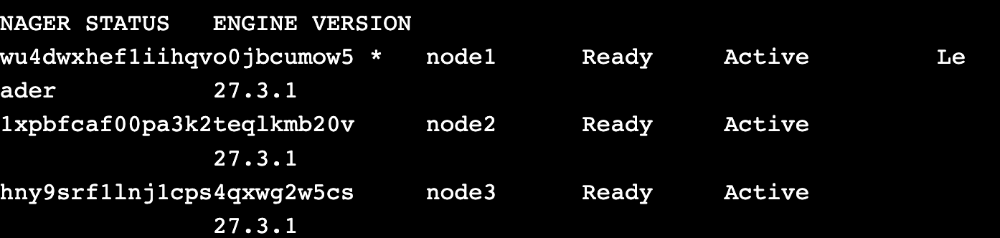

При переводе ноды в состояние Drain Swarm останавливает все задачи сервисов на этой ноде перепланирует их на другие ноды. Однако при возврате ноды в состояние Active Swarm не делает обратного ребаланса и не пересоздаёт задачи без явного обновления сервиса.

Проверка, что на второй ноде не запустились остановленные задачи, команда выполняется данной ноде

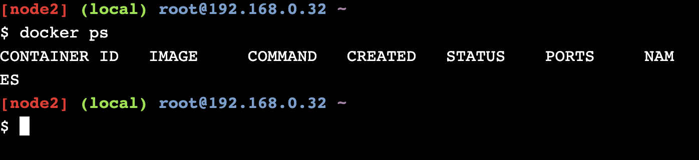

Чтобы на вновь активной ноде запускались задачи необходмо заново их перераспределить

```bash
docker service update --force <SERVICE_NAME>
```

Если у сервиса указано, что реплик всего 1 и она уже запущена на другой ноде, изменить их колчиество

```bash
docker service scale <SERVICE_NAME>=2
```

Запускам распределение задач между нодами и убеждаемся, что второй ноде была выделена задача

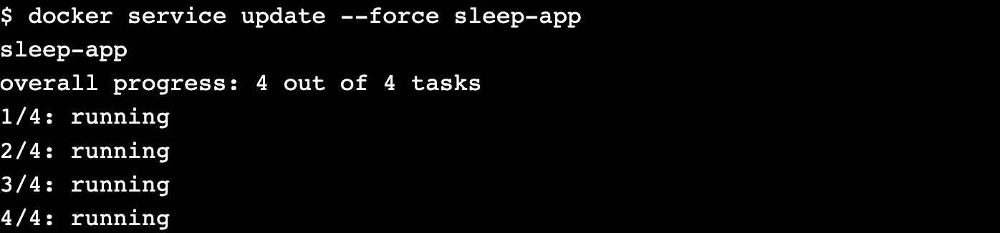

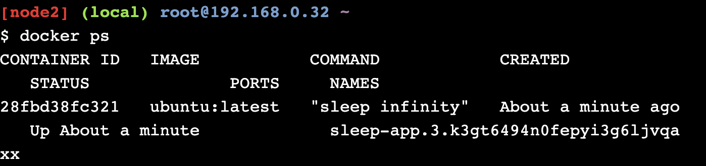

## Задание 5

Запуск приложения

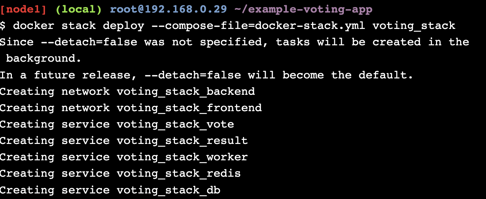

Проверка запущенных сервисов

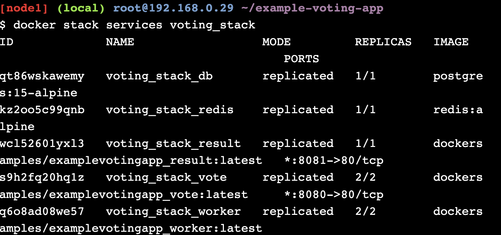

Распределение задач по нодам

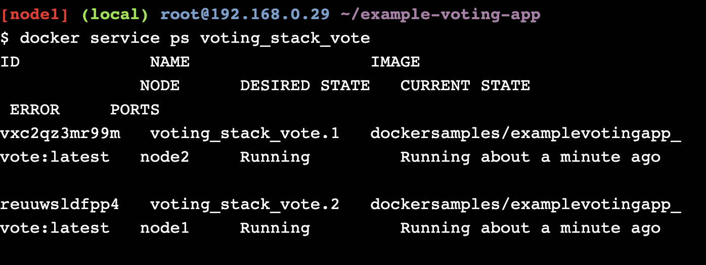

Количество реплик контейнеров сервиса указывается в файле `docker-stack.yml` параметром `replicas`

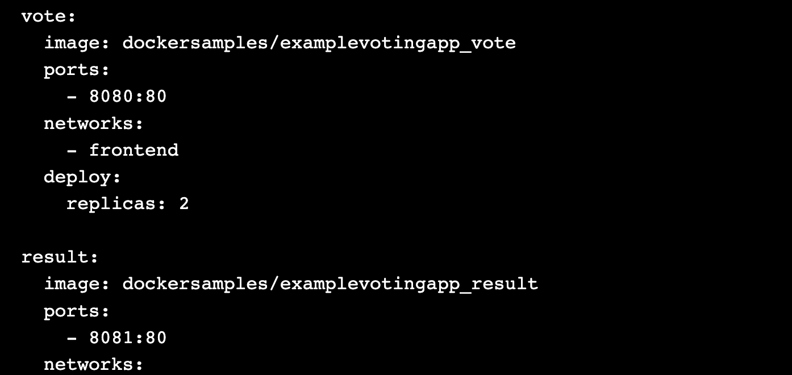

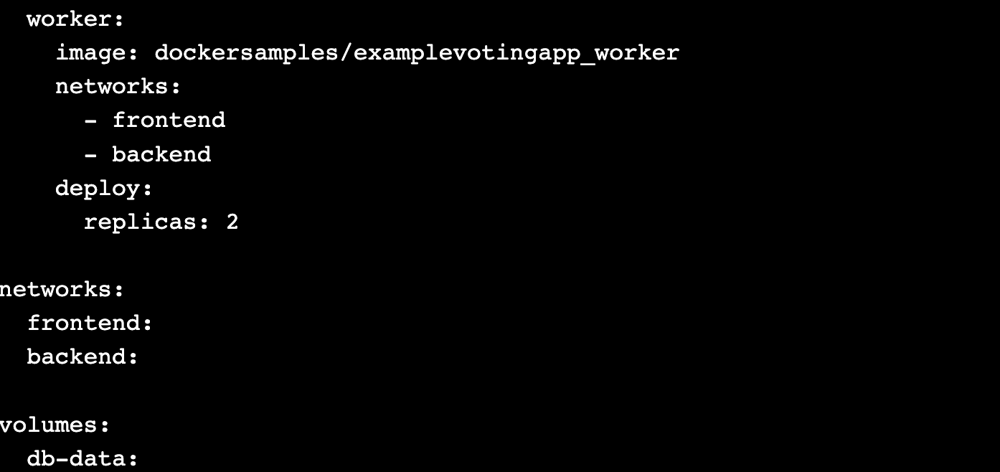

Жизнеспособность сервисов контролиурется встроенным механизмом Docker Swarm, который периодически запускает команду внутри контейнера и отслеживает ее код возврата (0 — healthy, ненулевой — unhealthy). Для конфигурации у сервисов описывается секция `healthcheck` с командой и дополнительными параметрами. Примеры секций из демонстрации

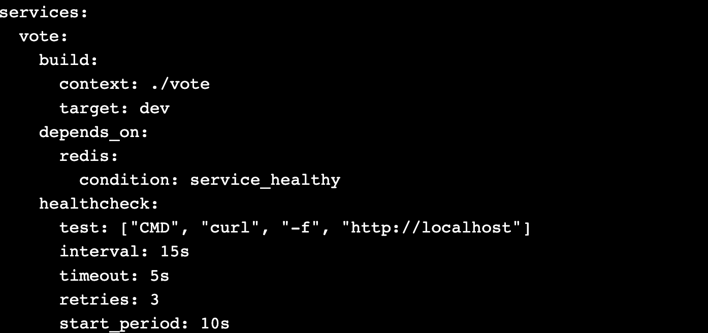

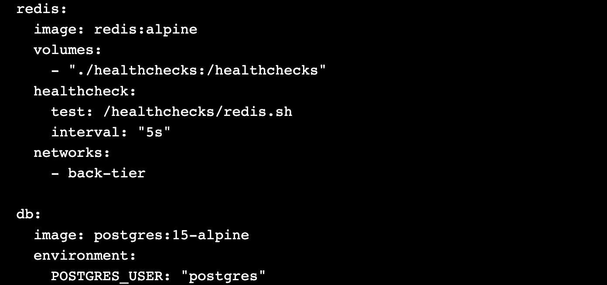

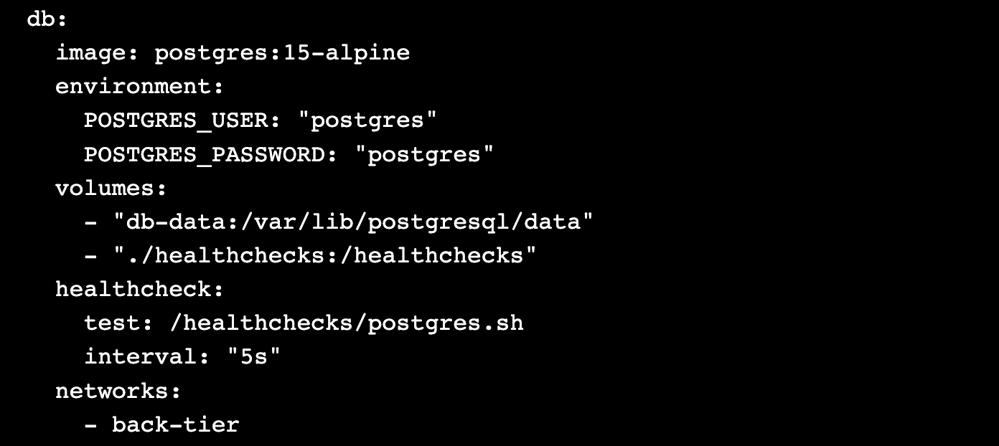

## Задание 6

Для сбора метрик использовалась утилита `hey`. Пример нагрузки: 50 параллельных пользователей, опрашивающих состояние счетчика в течение 1 минуты

```
hey -z 1m -c 50 http://localhost/api/counter
```

Метрики нагрузочного теста сохраняются в директории `reports`. Далее приведены агрегированные результаты.

### Docker Swarm

Перед началом работы необходимо сохранить образ приложения в локальный registry, затем в `docker-compose.yml` необоходимо указать его и добавить желаемое количество реплик

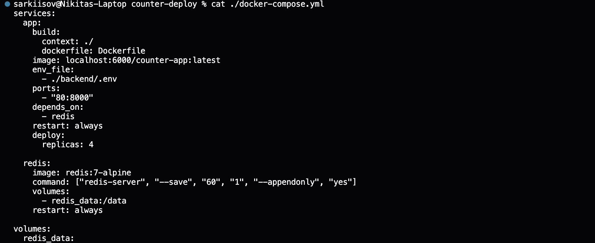

При реплицировании БД важно учитывать, что данные между копиями БД обновляются не мгновенно, поэтому приложение должно понимать, что на разных репликах данные могут временно отличаться. Репликация БД всегда предполагает механизм поддержки и синхронизации состояния.

Запущенное приложение с 4 репликами

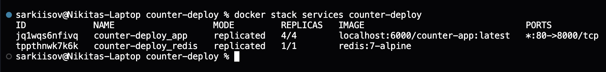

Результаты нагрузочного теста

| Метрика             | 1 реплика | 4 реплики | Изменение             |
| ------------------- | --------- | --------- | --------------------- |
| **Requests/sec**    | 45 694    | 54 154    | **+8 460 (+18.5%)**   |
| **Average latency** | 72.5 ms   | 38.1 ms   | **−34.4 ms (−47.4%)** |
| **Total test time** | 36.76 s   | 31.01 s   | **−5.75 s (−15.6%)**  |
| **Slowest request** | 19.02 s   | 11.02 s   | **−8.01 s (−42.1%)**  |

| Перцентиль | 1 реплика | 4 реплики | Изменение            |
| ---------- | --------- | --------- | -------------------- |
| **p50**    | 9.8 ms    | 8.2 ms    | **−1.6 ms (−16.3%)** |
| **p90**    | 15.0 ms   | 17.8 ms   | **+2.8 ms (+18.7%)** |
| **p99**    | 70.3 ms   | 1006.6 ms | **+936 ms (+1332%)** |

## Kubernetes

Конфигурационные файлы для kubernetes расположены в директории `k8s`

Запущенное приложение с 4 репликами

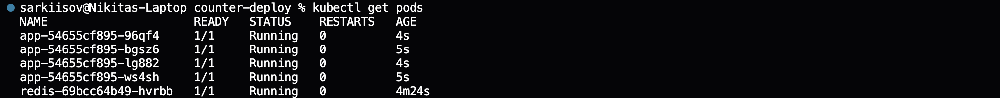

Результаты нагрузочного теста

| Метрика             | 1 реплика | 4 реплики | Изменение             |
| ------------------- | --------- | --------- | --------------------- |
| **Requests/sec**    | 49 131    | 53 318    | **+4 187 (+8.5%)**    |
| **Average latency** | 39.8 ms   | 24.6 ms   | **−15.2 ms (−38.2%)** |
| **Total test time** | 35.61 s   | 30.67 s   | **−4.94 s (−13.9%)**  |
| **Slowest request** | 19.01 s   | 11.01 s   | **−8.00 s (−42.1%)**  |

| Перцентиль | 1 реплика | 4 реплики | Изменение             |
| ---------- | --------- | --------- | --------------------- |
| **p50**    | 10.2 ms   | 5.6 ms    | **−4.6 ms (−45.1%)**  |
| **p90**    | 17.3 ms   | 13.2 ms   | **−4.1 ms (−23.7%)**  |
| **p99**    | 140.8 ms  | 74.4 ms   | **−66.4 ms (−47.2%)** |

## Выводы

Между Docker Swarm и Kubernetes не выявлено явного превосходства по ключевым метрикам производительности, их результаты сопоставимы. Конфигурация с 4 репликами показывает лучшую производительность: выше RPS и ниже средняя и медианная latency. Во эксперименте c Kubernetes улучшение наблюдается по всем ключевым метрикам, включая p99.

В эксперименте с Docker Swarm ухудшение tail-latency (p99) при 4 репликах вероятнее всего носит аномальный характер и может быть связано с:

- неравномерным распределением нагрузки между репликами;
- накладными расходами на установку соединений с разными репликами.

Для более корректного сравнения необходимо проводить многократные прогоны нагрузочных тестов (и/или более длительные тесты), чтобы сгладить случайные аномалии и опираться на усреднённые значения.
